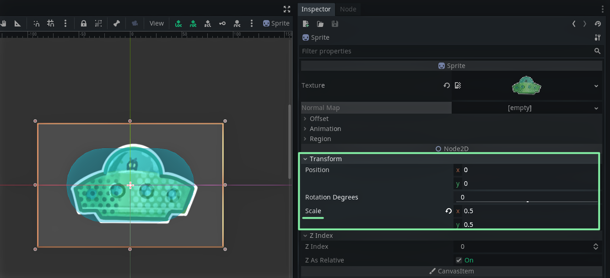
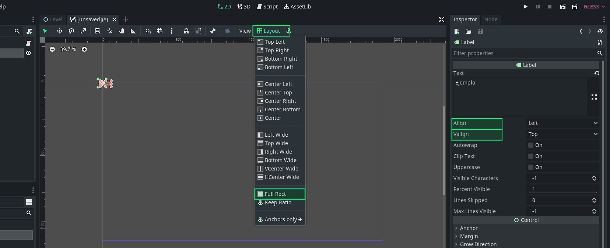

# Tutorial básico de Godot

Categoria: Godot, Tutorial
Estado: Redactando

# Empezando

Tutorial básico (nota mental: escribir en Nosotros/Ustedes)

Durante este tutorial utilizaremos la versión de Godot Engine 3.3.3, lo pueden descargar desde [https://godotengine.org/download](https://godotengine.org/download) 

# El proyecto: Space Coin

El proyecto que estaremos realizando en este tutorial


### Estructura del proyecto

En Godot cada elemento del juego son escenas,  por ejemplo: un jugador, un power-up, un nivel o una interfaz, son escenas. 


### Escenas y nodos

Las escenas están compuestas por composiciones de nodos. Los nodos  son los bloques básicos de construcción de un juego, en sí mismo los nodos no hacen mucho, pero la composición de estos en escenas lo hacen un sistema flexible y poderoso.


Si bien el proyecto está compuesto en su totalidad de nodos, podemos destacar algunos sistemas que podemos utilizar que serán responsabilidad de algunos nodos en concreto

- Timer: Permite ejecutar eventos dado un tiempo
- Area2D: Nos entrega un área de detección capaz de lanzar evento cuando está en contacto con otras áreas o cuerpos.

## Creando un proyecto en godot

Al abrir godot, el motor nos mostrará la lista de proyectos que hayamos creado, en nuestro caso procederemos a crear un nuevo proyecto.


Configuramos un nuevo proyecto, hay que considerar que el proyecto debe estar en una carpeta vacía, el editor te permite crear una carpeta con el nombre que le des al proyecto y seleccionar la ruta en donde se ubicara.


# La interfaz


1. Menus:
2. Espacios de trabajo
3. Panel de Playtest
4. Barra de herramientas
5. Jerarquía de la escena
6. FileSystem
7. Panel Inferior
8. Inspector
9. Node

# Comencemos

### Importando los Assets

Los recursos que usaremos para este tutorial los puedes descargar [aqui](https://github.com/rothbilly/basic_godot_tutorial_space_coin/tree/editor_branch/tutorial_assets).

1. Descomprime el archivo *.zip*, en la carpeta encontrarás 2 sub-carpetas:
    - `sprites`  Contiene las imágenes y texturas que usaremos para este tutorial
    - `sounds` Contiene los sonidos que se utilizaran para el proyecto
2. Arrastra ambas carpetas al **FileSystem,** tal y como se muestra en la figura siguiente


1. Adicionalmente, crearemos 2 carpetas más en este proyecto, haciendo click derecho sobre el **FileSystem** 
    1. `scripts` En esta carpeta guardáremos el codigo que crearemos para este tutorial
    2. `scenes` Aquí guardaremos las escenas que hayamos creado, en este caso serán tanto el nivel principal, la escena del jugador, los obstáculos, la moneda y la interfaz de usuario

Se habrán dado cuenta por defecto Godot crea dos archivos al iniciar un proyecto, un *`icon.png`* y un recurso *`default_env.tres` por ahora los dejaremos ahí y podemos ignorarlos.*

Finalmente el proyecto debería verse así por ahora:


## Configuración del proyecto

- Ajustamos la resolución de juego a 1920 x 1080  pixeles
- Configuramos el tipo de resolución a alta definición

## Creando la escena del  jugador

Según la misma documentación de  Godot: "Uno de los beneficios de crear una escena de jugador separada es que podemos probarla por separado, incluso antes de haber creado otras partes del juego." Este principio puede ser aplicado para cualquier elemento de los juegos que deseemos crear. 

Para crear una nueva escena, ir al panel superior > Scene > New Scene

Comenzaremos por crear la escena del jugador, para ello en nuestra jerarquía de escenas __**donde dice "Scene"**__ haremos click en el icono "+" de la parte superior izquierda del panel o donde dice **"Other Node"**, el cual desplegara la lista de **Nodos** que tendremos disponibles a nuestra disposición.


De aquí buscaremos el nodo `KinematicBody2D`, el cual será la base de nuestro jugador. 

`KinematicBody2D` es un nodo que permite crear un cuerpo con forma definida, esto permite que nuestro jugador responde a las colisiones con otros objetos que tengas un cuerpo (Obstáculos) y la detección de áreas (Monedas y peligros).

Seleccionando el nodo `KinematicBody2D`  recién creado, le agregaremos 2 nodos hijos:

- Un `Sprite` para renderizar y mostrar la imagen de nuestro jugador.
- Un `CollisionShape2D` para definir la forma del cuerpo.


Al `Sprite` le debemos agregaremos la textura de nuestra nave `space_ship.png`. Seleccionamos el nodo `Sprite` y en el **Inspector** (Panel a la derecha) podemos observar varias propiedades del nodo que hemos seleccionado. Dentro del inspector nos interesa la propiedad Textura. Para asignar la textura de la nave arrastra la imagen desde el inspector. 


El Sprite está un poco grande respecto al tamaño del canvas, por



Nos queda agregar una forma a nuestro nodo `CollisionShape2D` , para ello, similar al sprite, seleccionamos en nodo `CollisionShape2D`  y en el inspector podemos ver que hay un campo llamado `shape` 

Finalmente renombraremos el nodo `KinematicBody2D` haciendo doble click en el mismo y cambiando el nombre del nodo a `Player` o `Ship.`

Aprovecharemos de guardar la escena. **`Ctrl+S`**  en Windows/Linux o `Cmd + S` en macOS o en la barra superior > Scene > Save Scene.  Guardaremos la escena `Player.tscn` en la carpeta `scene` que creamos al comienzo del proyecto.

### Código del jugador

Para este proyecto, seguiremos las convenciones de nombrado de Godot:

- **GDScript**: Clases (Nodos) se usa `PascalCase`, para las variables y funciones usaremos `snake_case`, y las constantes serán en `ALL_CAPS` ([GDScript style guide](https://docs.godotengine.org/en/stable/getting_started/scripting/gdscript/gdscript_styleguide.html#doc-gdscript-styleguide)).

Para agregar código a nuestro jugador


Al hacer click nos saldrá la siguiente ventana en la cual podemos configurar algunos aspectos de nuestro código.


El panel de creación de script debería verse así, importante guardar el archivo en nuestra carpeta **scripts** y nombramos en archivo `player.gd`.

Al crear nuestro código, veremos el editor de código muy parecido a lo siguiente, está editado para que se entienda mejor que hace cada función:

```python
extends KinematicBody2D 
#esta sentencia nos dice que el script que creamos extiende un nodo del tipo "KinematicBody2D"

# Aqui se realiza la declaración de variables
var a = 2
var b = "text"

func _ready(): 
	# "_ready()" función se ejecuta cuando el nodo entra en acción por primera vez
	pass

func _process(delta): # "_process(delta)" funcion que se llama cada frame, 
	#"delta" es el tiempo que pasa entre cada frame
	pass
```

Por ahora borremos todo, dejando solamente la primera línea de código `extends KinematicBody2D` 

### Definición de variables del jugador

Lo primero que haremos serán definir las variables de nuestro jugador.

```python
extends KinematicBody2D

export var speed : int = 20
var direction: Vector2 = Vector2.ZERO

onready var anim_node := $AnimationPlayer
```

Primero definimos la velocidad `speed` de nuestro jugador.  Para definir una variable usamos la palabra clave `var`. Opcionalmente usando: `int = 20` le decimos al programa que la variable es un entero `int` y que su valor inicial será de 20. finalamente colocar al comienzo la palabra clave `export` permite exponer la variable en el I**nspector.** 


La variable `speed` al ser expuesta en el Inspector

Luego creamos la variable `direction` de tipo `Vector2` y le asignamos un valor de (0,0) por defecto mediante `Vector2.ZERO`. Este variable será el vector de dirección de nuestro jugador cuando queramos moverlo mediante el teclado.

Un `Vector2` siempre tiene dos componentes del tipo (x, y), por ejemplo un `mi_vector = Vector2(2, 1)` tiene un componente `x = 2` y un `y = 1`. Para acceder a un componente de un vector, puedes hacerlo llamando a la variable `mi_vector.x` y `mi_vector.y` respectivamente.

### Obtener el input

```python
func get_input():
	direction = Vector2.ZERO
	
	direction.x = Input.get_action_strength("ui_right")
	direction.x = direction.x - Input.get_action_strength("ui_left")
	
	direction.y = Input.get_action_strength("ui_down")
	direction.y = direction.y - Input.get_action_strength("ui_up")
	
	direction = direction.normalized()
```

Procesar el movimiento

```python
func _physics_process(delta):
	get_input()
	velocity = direction * acelearation * delta * VIEW_SCALE
	
	velocity = move_and_slide(velocity)
```

Ajustar el jugador a la vista

Agregamos 2 nuevas variables

```python
onready var screen_size = get_viewport_rect().size
onready var shape = $CollisionShape2D.shape
```

```python
	position.x = wrapf(position.x, 0, screen_size.x + shape.height * 0.5)
	position.y = wrapf(position.y, 0, screen_size.y + shape.radius * 0.5)
```

Código completo del jugador

```python
extends KinematicBody2D
class_name Player

const VIEW_SCALE = 100

export var acelearation :int = 200 

var direction: Vector2 = Vector2.ZERO
var velocity = Vector2.ZERO

onready var screen_size = get_viewport_rect().size
onready var shape = $CollisionShape2D.shape
	
func _physics_process(delta):
	get_input()
	
	velocity = direction * acelearation * delta * VIEW_SCALE
	velocity = move_and_slide(velocity)
	
	position.x = wrapf(position.x, 0, screen_size.x + shape.height * 0.5)
	position.y = wrapf(position.y, 0, screen_size.y + shape.radius * 0.5)

func get_input():
	direction = Vector2.ZERO
	
	direction.x = Input.get_action_strength("ui_right")
	direction.x = direction.x - Input.get_action_strength("ui_left")
	
	direction.y = Input.get_action_strength("ui_down")
	direction.y = direction.y - Input.get_action_strength("ui_up")
	
	direction = direction.normalized()
```

## Creando los obstáculos

Creamos una nueva escena, desde el menú superior → Scene → New Scene


## Creando la escena del nivel

Creamos una nueva escena, desde el menú superior → Scene → New Scene


### Componiendo la escena

Agregamos un nodo **`Node2D`**  como nodo base de la escena del nivel, renombramos el nodo a `Level` y agregamos un nuevo nodo `Sprite` como hijo, además aprovechamos de agregar nuestro jugador a la escena 


Del menú desplegable seleccionamos la escena `scene/Player.tscn` para agregar al jugador a nuestra escena

También de la misma forma podemos agregar los obstáculos seleccionando la escena `scene/Planet.tscn`, como queremos varios planetas podemos duplicar un nodo con **Ctrl+D**

Podemos ordenar y mover los obstáculos y al jugador con la segunda herramienta de la **barra de herramientas** alternativamente con el atajo **W**


## Creando las monedas

Creamos una nueva escena


```python
extends Area2D
class_name coin

var point = 5

var player : Player
```


```python
func _on_Coin_body_entered(body):
	pass # Replace with function body.
```

```python
func _on_Coin_body_entered(body):
	if body is Player:
		body.grab_point(point)
		self.queue_free()
```

```python
signal coin_grabed

func grab_point(_points):
	emit_signal("coin_grabed", _points)
```

### Probando la recolección de moneda

Agregamos las escenas de  monedas a la escena nivel...


Probamos nuestra escena con la tecla F6 o haciendo click en el panel de Testeo, con F5 podemos elegir la escena principal de nuestro juego, es decir la escena en la cual nuestro juego comenzara siempre, en nuestro caso usaremos F6 que nos permite ejecutar la escena en la que nos encontramos.


### Randomizar la posición de las monedas

```python
onready var screen_size = get_viewport_rect().size

func randomise_pos():
	self.position.x = rand_range(0, screen_size.x)
	self.position.y = rand_range(0, screen_size.y)
```

Llamamos la función desde el método `_ready()`.

```python
func _ready():
	randomise_pos()
```

Y también lo llamamos desde la señal de `_on_Coin_body_entered(body)` para cuando un objeto entre al área de la moneda y sea distinto al jugador.

```python
func _on_Coin_body_entered(body):
	if body is Player:
		body.grab_point(point)
		self.queue_free()
## Agregamos un else para cualquier otro elemento distinto del jugador
	else:
		randomise_pos()
```

La forma más simple es agregar una condición para cualquier objeto distinto al jugador.

### Codigo completo de la moneda

```python
extends Area2D
class_name coin

var point = 5
var player : Player

onready var screen_size = get_viewport_rect().size

func _ready():
	randomise_pos()

func _process(delta):
	
	pass

func randomise_pos():
	randomize()
	self.position.x = rand_range(0, screen_size.x)
	self.position.y = rand_range(0, screen_size.y)

func _on_Coin_body_entered(body):
	print("enter")
	if body is Player:
		body.grab_point(point)
		self.queue_free()
	else:
		randomise_pos()
```

## Creando la lógica del nivel

En esta sección aún nos queda implementa la lógica de nuestro juego, dentro de las tareas que quedan:

- Crear las monedas de forma automática  y aleatorea sin que queden dentro de los planetas
- Llevar la cuenta de las monedas que sé han recogido
- Actualizar el contador de monedas de la interfaz

### Script del nivel


```python
extends Node2D
class_name Level

export (PackedScene) var CoinScene #Escena de las moneda
export var max_coin: int  = 5 # Cantidad de monedas que queremos en la escena
```


Para poder hacer aparecer monedas debemos

En el **Inspector** aumentamos en contador de monedas `max_coin` que aparecerán en nuestro juego

  


## Creando la interfaz

Antes de empezar...

Utilizaremos la tipografía `Kenney Future`, pero ustedes pueden ocupar cualquiera. Pueden descargar las tipografías de forma gratuita en [https://www.kenney.nl/assets/kenney-fonts](https://www.kenney.nl/assets/kenney-fonts)

### Creando escena de interfaz

Creamos una nueva escena de la misma forma que lo hemos hecho para los otros componentes. 

No en todos los casos es necesario crear una nueva escena, sobre todo si son pocos nodos, aun así es una buena práctica mantener escenas separadas cuando la lógica también se maneja de forma aislada, como en el caso de una interfaz.  


En nuestro caso queremos alinear el texto al centro de la pantalla, para ello seleccionando el nodo `Label` debemos ajustar el `Layout` desde el panel de herramientas a `Full Rect` para que el nodo cubra todo el contenedor. Además en las propiedades del inspector Aprovechamos de ajustar el `Align` y el `Valign` ambos a `Center`, esto nos permitirá ajustar el texto al centro de su contendor.



En la propiedad `Text` podemos colocar por ahora un texto de ejemplo, en nuestro caso sera un contador así que escribiremos `"0"` 

Para poder agregar nuestra tipografía y además cambiar el tamaño de nuestra fuente (que como pueden notar es tan diminuta que no se alcanza a ver en pantalla) debemos ir a la propiedad `Font` en el apartado `Custom Fonts` de nuestro nodo `Label` y crear un nuevo `DynamicFont`


Haciendo Click en el `DynamicFont` recién creado, se expandirán las propiedades de este "Recurso", en nuestro caso nos centraremos `Settings` y en `Font`.  

1.  Agregamos nuestra tipografía `Kenney Future Square.ttf` desde el **FyleSystem** hacia la casilla en `Fonts`  > `Font Data`
2. En Settings: podemos editar el tamaño de la fuente, en este caso lo vamos a dejar en un tamaño de 512.


Para cambiarle el color o bajar la opacidad de nuestro texto, debemos modificar el `self_modulate` en el apartado de **Visibility** de nuestro nodo **`Label`**


En nuestro caso le bajaremos la opacidad al texto, bajando el deslizador Alpha `A` a 50.


 Guardamos la escena de la interfaz y la agregamos a nuestra escena principal `Level`. Arrastramos el nodo `CanvasLayer` (nuestra interfaz) de tal forma que quede después del nodo `Sprite` (Fondo)


Ahora nuestra interfaz estará entre el fondo y los elementos del juego. 


Volviendo a nuestra escena de interfaz. Creamos un script y se lo agregamos al nodo `CavasLayer`, este script se encarga de actualizar nuestra interfaz cada vez que recojamos una moneda.


```python
extends CanvasLayer

func update_gui(total: int):
	$Label.text = str(total)
```

El único código que necesitamos en nuestra interfaz es una fusión `update_gui` que obtenga el nodo `Label` y le asigne a la propiedad `text` el total de nuestro puntaje `total`. Esta funcion sera llamada desde nuestra escena principal.

### Conectando la señal de las monedas

Lo único que nos queda es hacer desde la escena principal `Level` sepa cuando recogimos una moneda. En el jugador creamos una señal llamada `coin_grabed`, para conectarlo, desde la escena `Level` seleccionamos el Nodo `Player`  y en la pestaña **Node** conectamos la señal `coin_grabed` con el script del nivel.


Al crear la conexión, automáticamente nos creará una función/método llamada `_on_Player_coin_grabed()`. 

Dentro de esta función haremos 2 cosas:

1. Aumentar el contador de puntos
2. Llamar la función que actualiza la Interfaz

```python
var total_coin: int = 0

func _on_Player_coin_grabed(_point):
	total_coin += _point
	$CanvasLayer.update_gui(total_coin)
```

En el script [`Level.gd`](http://level.gd) creamos una variable global que llevara la cuenta del total de monedas `total_coin` y lo asignamos a 0. Dentro de nuestra función `_on_Player_coin_grabed` aumentamos el contador sumando los puntos que da cada moneda `_point`  y finalmente llamamos al nodo de nuestra interfaz `$CanvasLayer` y llamamos a la función que creamos `.update_gui(total_coin)`

Probamos el juego con la tecla f5 o f6 y nuestro puntaje debería aumentar cada 5 puntos


### Código completo del nivel

```python
extends Node2D
class_name Level

export (PackedScene) var CoinScene ##Escena de las moneda
export var max_coin: int  = 100

onready var screen_size = get_viewport_rect().size

func _ready():
	for i in max_coin:
		instaciate_coin()
		pass
	pass 

func instaciate_coin():
	var coin = CoinScene.instance()
	add_child(coin)

var total_coin: int = 0

func _on_Player_coin_grabed(_point):
	total_coin += _point
	$CanvasLayer.update_gui(total_coin)
```

## Extras

Algunas ideas que puedes implementar por tu cuenta

- Hacer que aparezcan monedas cada vez que recoges una
- Animación de la nave espacial

# Conclusiones

Cualquier duda o consultas pueden hacerlas enviando correo a roth81ly@gmail.com 

Revisa el código fuente de este proyecto en GitHub si:

- Si quieres apoyar a mejorar este tutorial
- Copiar el proyecto